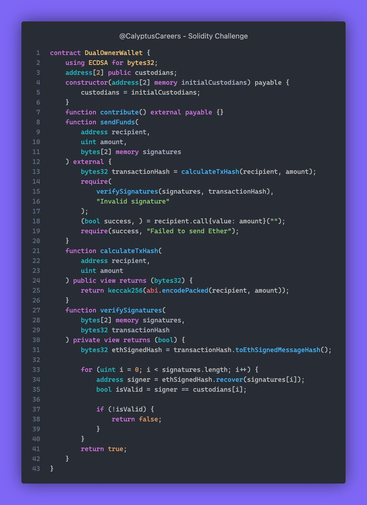

# Solidity Challenge #369 🕵️‍♂️
Introducing the KittyBank contract, a whimsical bank for feline aficionados to store their CatCoins 🐈

### What Went Wrong?
1. Issues with verifying signatures.
2. Mishandling of the message format.
3. Incorrect signer address recovery.
4. Incorrect methods for handling Ethereum signed messages.

### Example
1. Custodians sign a transaction with private keys.
2. Contract fails to verify signatures correctly.
3. Transaction wrongly rejected with "Invalid signature" error.

### Solution
1. Use the ECDSA library correctly.
2. Hash the message correctly before signing.
3. Use toEthSignedMessageHash for recovery.