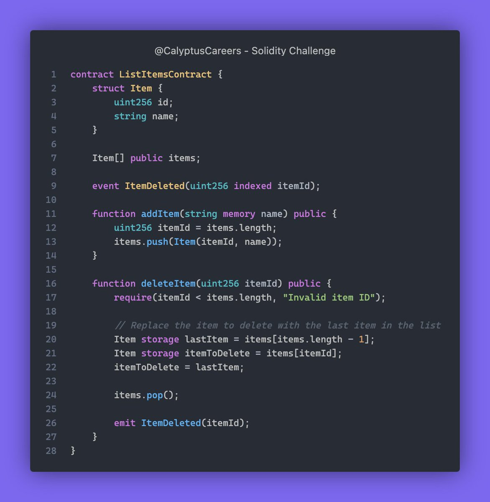

# Solidity Challenge #372 🕵️‍♂️
This contract lets you add and delete items from a list, but it has issues.

### Issues
1. Data Overwriting: The deleteItem function moves the last item to the deleted item's spot but doesn't update its ID.
2. Event Emission: The ItemDeleted event emits the wrong item ID.
3. Missing Items Tracking: The contract doesn't handle item removal correctly, causing data issues.

### Example
If you delete item ID 1 from a list with items 0, 1, 2, and 3, item 3 moves to index 1 but keeps its ID 3. This causes a data mismatch.

### Solution
1. Correct Data Overwriting: Update the ID of the moved item.
2. Correct Event Emission: Emit the correct item ID after deletion.
3. Consistent State Maintenance: Keep the list consistent after deletions.