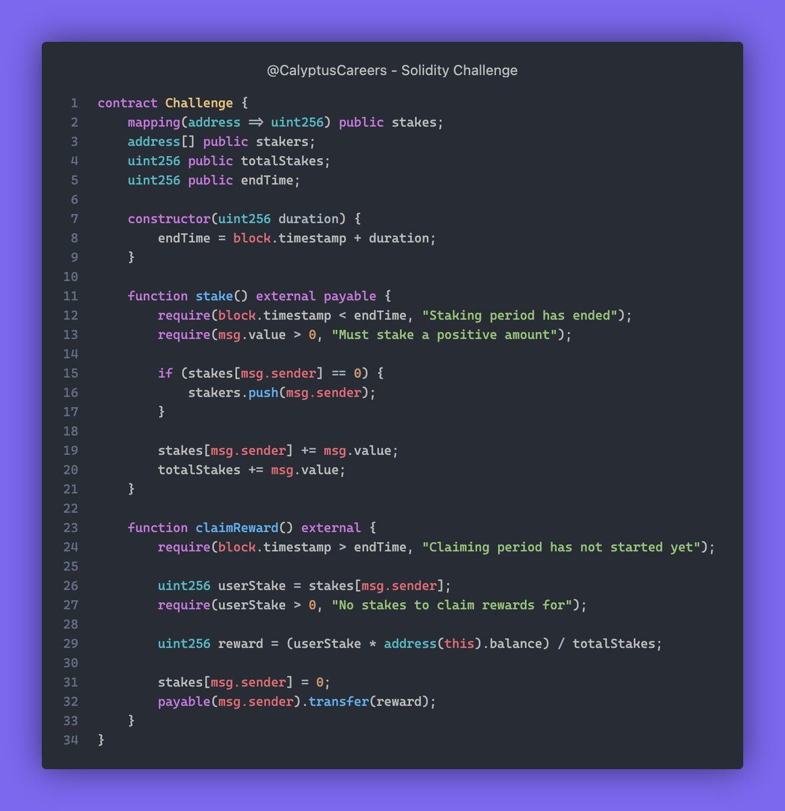

# Solidity Challenge #374 🕵️‍♂️
From a game theory standpoint, what changes would you make to this staking contract to ensure fairness for all participants? 👨‍💻

### What Went Wrong?
1. Reentrancy issue when transferring rewards.
2. No error handling for zero balance.

### Example
1. Multiple users claiming rewards simultaneously can drain the contract.

### Solution
1. Use checks-effects-interactions pattern to prevent reentrancy.
2. Check for zero balance before transferring rewards.