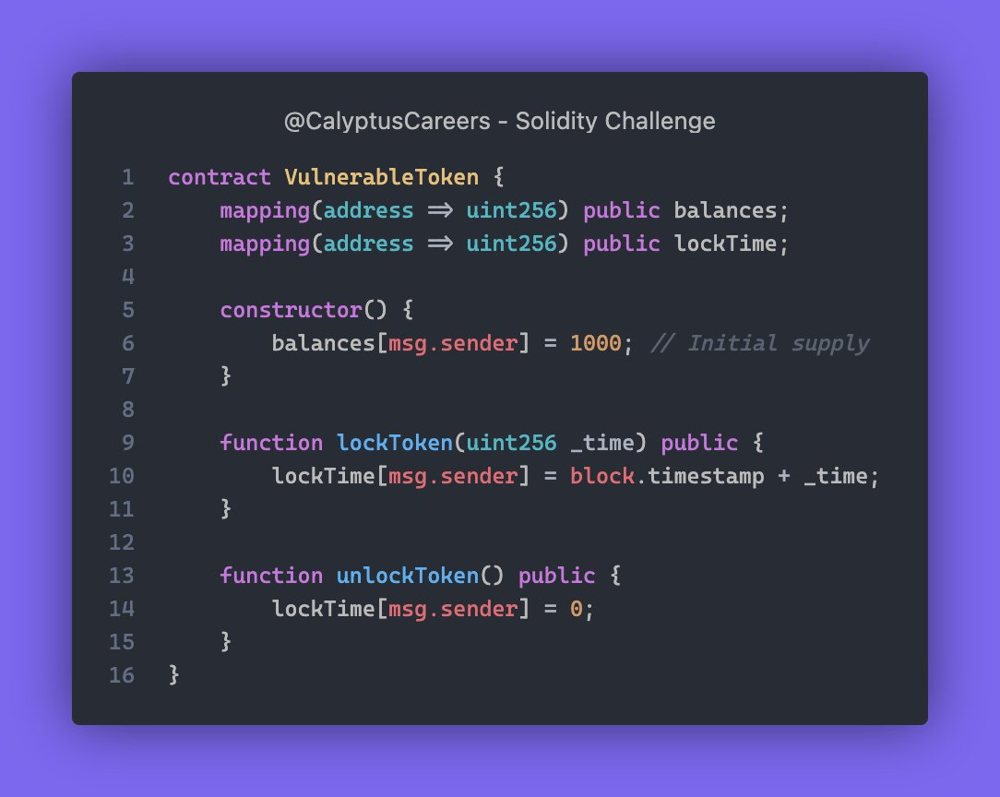

# Solidity Challenge #382 🕵️‍♂️

## ⚔️ Battle of the Checks!

What security checks would you add to the functions in the smart 
contract below to enhance its security?

### Problem Explanation
A token contract where users lock tokens for a time and unlock them later.

### Issues
1. **Unlock Anytime**: Users can unlock tokens without checking the lock period.
2. **No Token Transfer**: No function to transfer tokens between addresses.
3. **Initial Supply Issue**: Only the creator gets tokens initially, no way to distribute to others.

### Example
1. Alice locks tokens for 1 hour.
2. After 10 minutes, Alice can still unlock tokens because there's no lock period check.

### Solution
1. **Check Lock Period**: Only unlock tokens after the lock period.
2. **Add Token Transfer**: Create functions to transfer tokens.
3. **Distribute Tokens**: Allow initial tokens to be given to others.