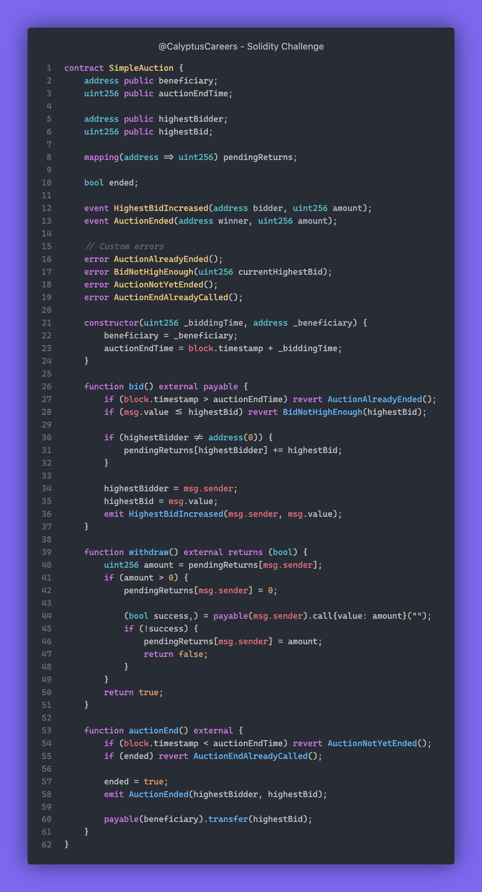

# Solidity Challenge #383 🕵️‍♂️

Have a look at this Auction contract. Would you feel confident deploying it? 👀

## Problem Explanation

Imagine we have an auction where people can place bids. The highest bidder wins, and the others can get their money back.

Here's the simplified process:

1. **Bidding**: People send money to place bids. If someone bids higher than the current highest bid, they become the new highest bidder.
2. **Withdraw**: People who were outbid can withdraw their money.
3. **End Auction**: When the auction ends, the highest bid goes to the auction owner.

## What Went Wrong?

The original withdraw function has a bug called a re-entrancy attack. Let's see how this could happen with an example.

### Example:

1. Alice places a bid of 1 ether.
2. Bob outbids her with 2 ether.
3. Alice tries to withdraw her 1 ether.

If Alice's withdrawal request goes to her smart contract (not her directly), this contract could be malicious and call `withdraw` again before the first call finishes. This way, Alice's contract could keep asking for her money back multiple times before the system realizes she has already been refunded.