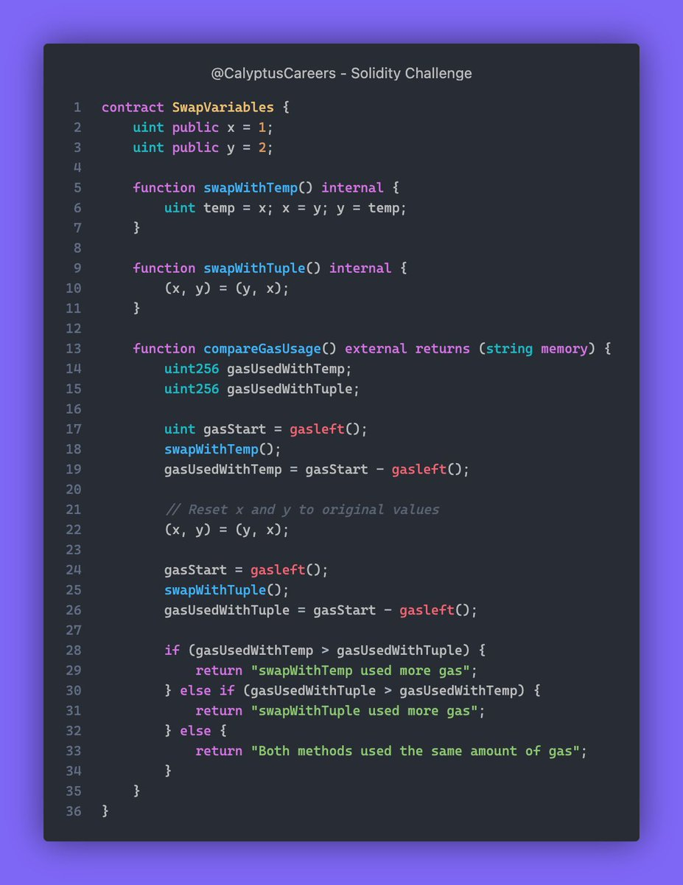

# Solidity Challenge #394 🕵️‍♂️

Guess the output of the compareGasUsage() function and also tell us if or why you would choose it. 👇

### What Went Wrong?
Gas usage measurement for the two swap methods.
No clear issues in the provided contract code.

### Example
Comparison of gas usage between two swap methods: swapWithTemp and swapWithTuple.

### Solution
Code is correctly measuring gas usage and comparing results.
Testing required for verification.