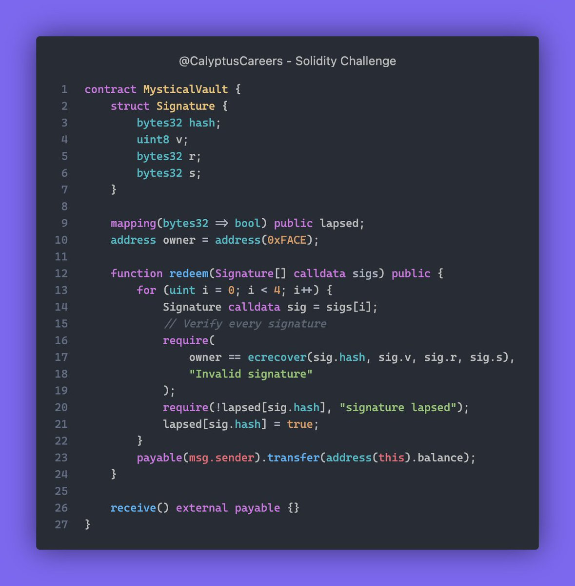

# Solidity Challenge #396 🕵️‍♂️

What are the potential security vulnerabilities in this smart contract?

### Problem Explanation
The MysticalVault contract transfers its balance to the caller if four valid signatures are provided. There are several issues that could lead to failures or vulnerabilities.

### What Went Wrong?
1. Fixed Loop Limit: The loop only iterates 4 times, assuming exactly 4 signatures are always required.
2. Signature Verification: Only checks if the recovered address from the signature matches the owner address.
3. Replay Attack Vulnerability: Signatures can be reused, causing multiple unauthorized transfers.
4. Inconsistent State Management: The lapsed mapping is updated after the transfer, leading to potential re-entrancy issues.

### Example
1. The contract receives 10 ETH.
2. A user tries to redeem using 4 valid signatures.
3. The contract transfers the balance but does not update the state correctly, allowing for possible re-entrancy attacks.

### Solution
1. Dynamic Loop Limit: Use the length of the sigs array for iteration.
2. Enhanced Signature Verification: Check signatures dynamically.
3. Prevent Replay Attacks: Ensure signatures cannot be reused.
4. Consistent State Management: Update the lapsed mapping before transferring funds.