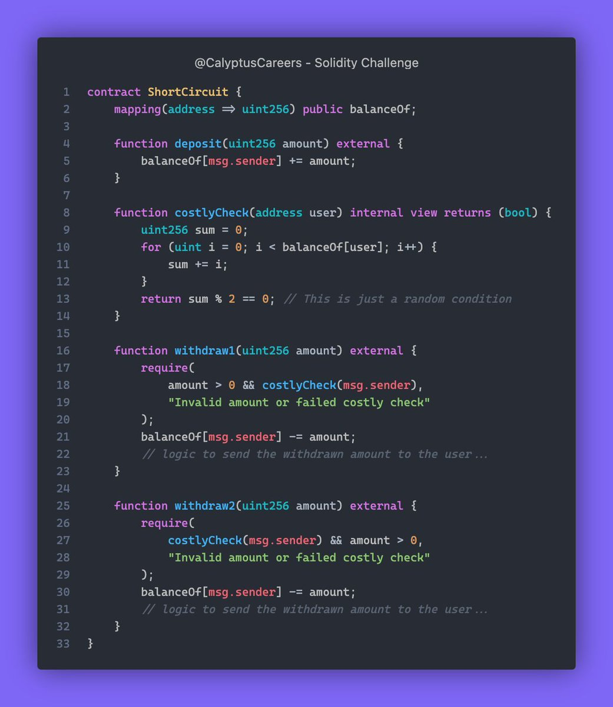

# Solidity Challenge #414 🕵️‍♂️

In the showdown between the two withdraw functions in the ShortCircuit smart contract, to which withdraw function will your vote go, and why?

### Problem Explanation
The ShortCircuit contract has inefficiencies in its withdrawal functions due to unnecessary computations and inefficient logical order of checks.

### Issues
1. Unnecessary Computations: withdraw1 calls costlyCheck even if the amount is zero.
2. Inefficient Logical Order: withdraw2 calls costlyCheck before checking if the amount is greater than zero.others.

### Example
1. A user deposits 10 units.
2. The user tries to withdraw 0 units using withdraw1.
3. costlyCheck is called unnecessarily, wasting computational resources.

### Solution
1. Optimize the order of checks to ensure costlyCheck is called only when necessary.