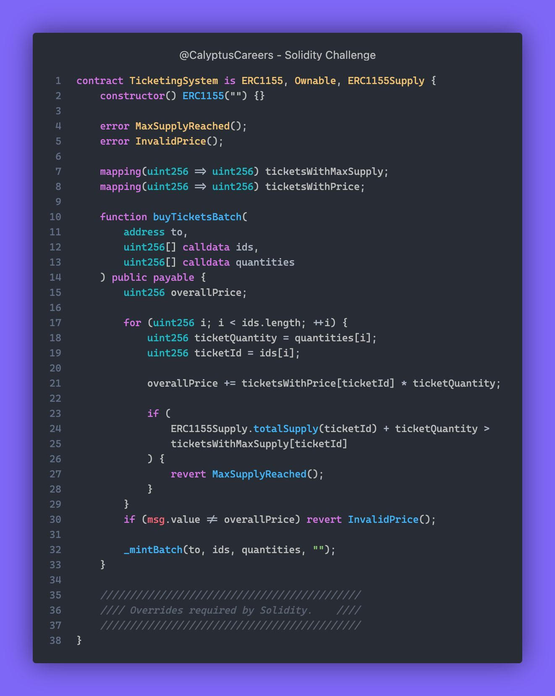

# Solidity Challenge #422 🕵️‍♂️
FestivalCoin's new smart contract allows fans to buy event tickets in batches. The dev team is proud, but the security auditor is suspicious.

### What Went Wrong?
1. The contract has issues with managing ticket sales.
2. It must ensure the maximum number of tickets isn't exceeded.
3. The correct price must be paid for the tickets.

### Example
1. When buying tickets for multiple events:
   - The total price must be calculated correctly.
   - The number of tickets sold must not exceed the limit.
   - The user must pay the exact total price.

### Solution
1. Ensure the logic for calculating the total price is correct.
2. Check that the ticket supply limits are enforced.
3. Validate these functionalities with Hardhat and Foundry tests.