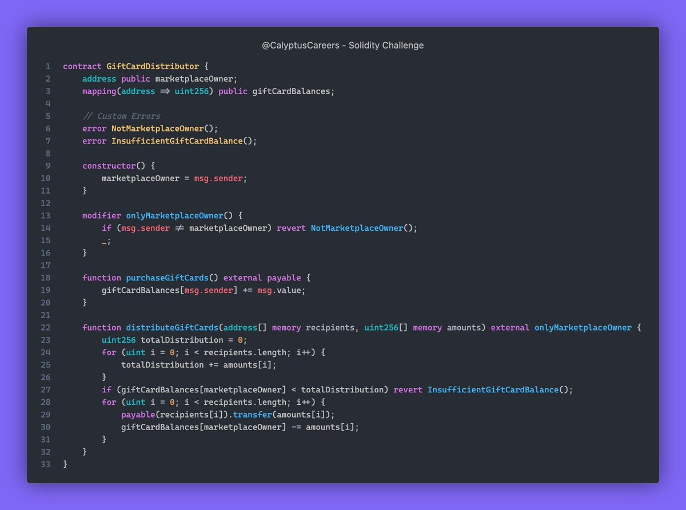

# Solidity Challenge #422 🕵️‍♂️
Our GiftCardDistributor smart contract lets users buy gift cards with Ether, and owners can distribute them to multiple recipients for promotions or rewards. 

### What Went Wrong?

1. **Potential Overflows in `distributeGiftCards`**:
   - The current implementation sums up all the amounts in a loop. If the `amounts` array is too large, this could lead to a potential overflow in `totalDistribution`.

2. **Lack of Validation**:
   - There is no validation to check if the `recipients` array length matches the `amounts` array length, which can lead to unpredictable behavior or unintended errors.

3. **Security Concern**:
   - `transfer` is used to send Ether, which forwards only 2300 gas. If a recipient's fallback function needs more than 2300 gas, the transfer will fail. Using `call` with a specified amount of gas may be safer.

4. **Unused Funds in `purchaseGiftCards`**:
   - The `purchaseGiftCards` function allows users to add funds to their balance. However, the `distributeGiftCards` function only distributes funds from the `marketplaceOwner`. The contract doesn’t use the funds from the user balances, which seems inconsistent.

### Example

### Solution

1. **Overflow Protection**:
   - Added a check for matching lengths of `recipients` and `amounts` to ensure input consistency.

2. **Validation**:
   - Introduced an `InvalidInput` error that reverts if the `recipients` and `amounts` arrays have different lengths.

3. **Safe Ether Transfer**:
   - Replaced `transfer` with `call` to handle situations where recipients may need more gas for processing the transaction.

4. **Consistency**:
   - The logic remains that only the `marketplaceOwner`'s balance is used for distribution, which is consistent with the initial design but now ensures more secure transfers.